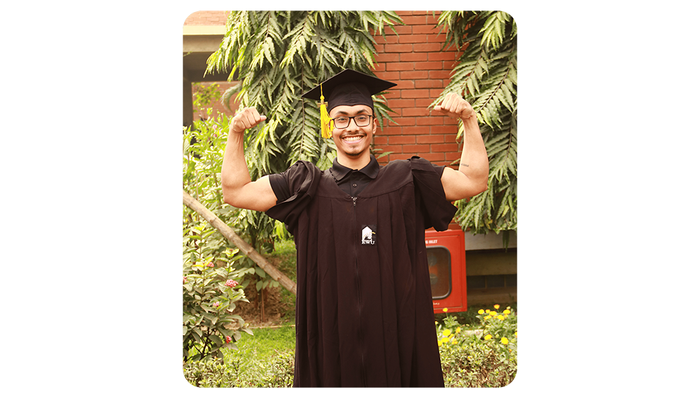

## ./About me

**Ernest Becker** - 
> ‘To live is to engage in experience, at least partly on the terms of the experience itself.’

I remember, back in 2002 we moved from our village (Khararia, Narail, Khulna) to Dhaka (capital of **Bangladesh**, housing the best educational institutions in my country) to pursue better education. At that time, my elementary level art teacher **Robin Mandal** sir told me to do something for my village and our country. Although, I was too young to understand his words. Now, it's definitely one of the driving force for me.

My interests for tech started to grew while I was at High School, which along with other factors was a boost to choose Computer Science as my field of studies. 
> Definitely the best decision of my life.
